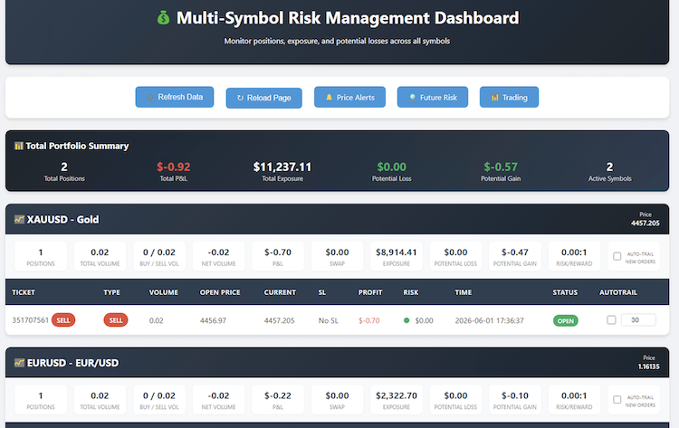
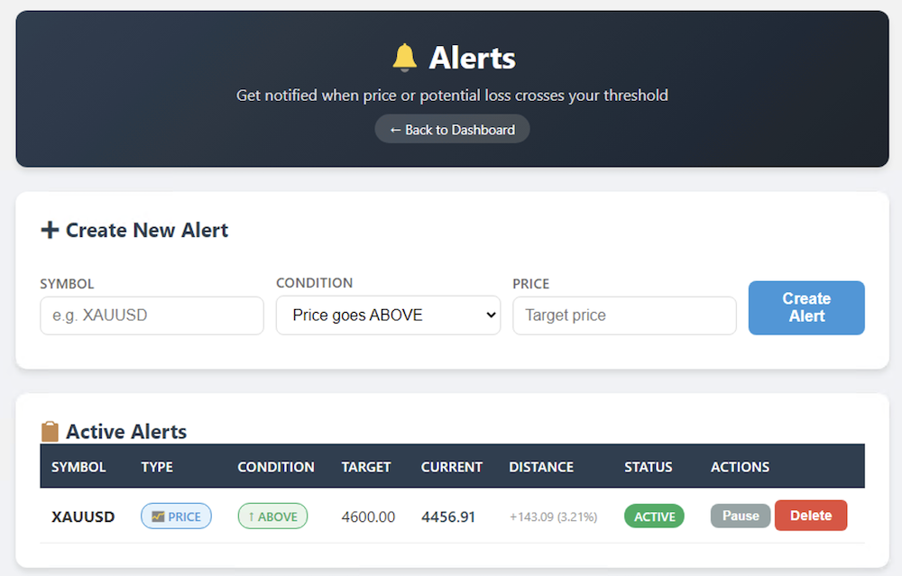
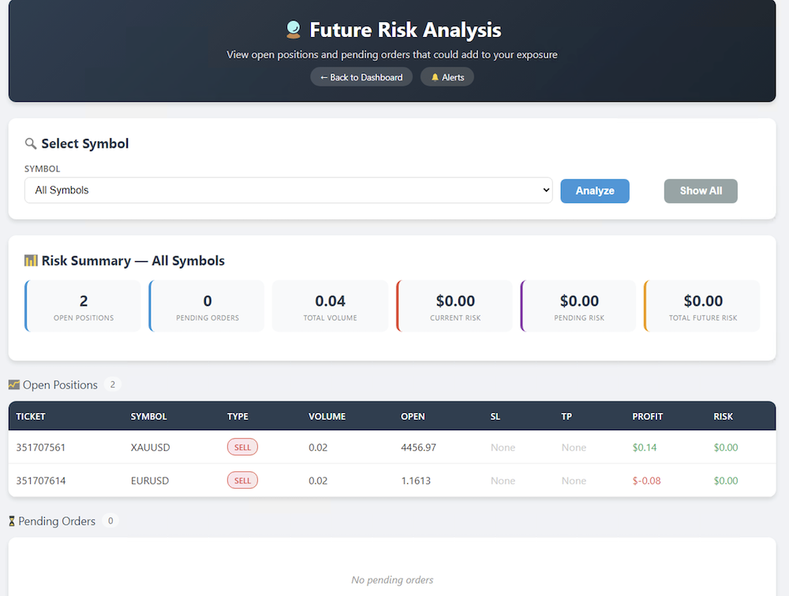
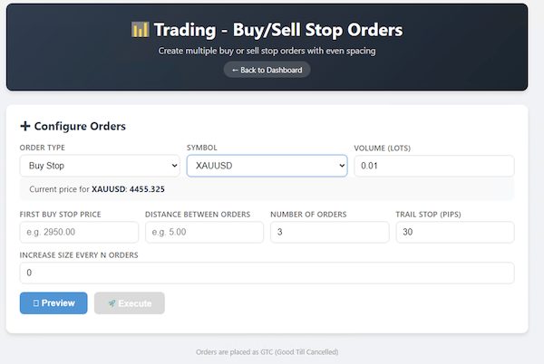
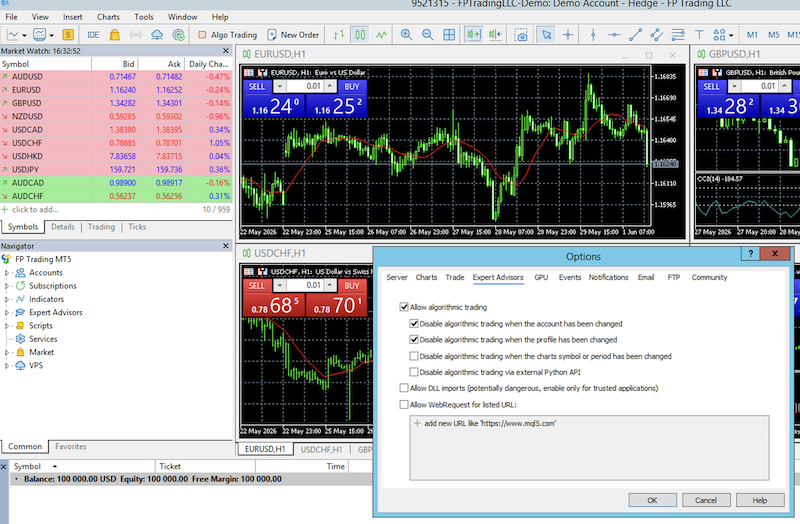
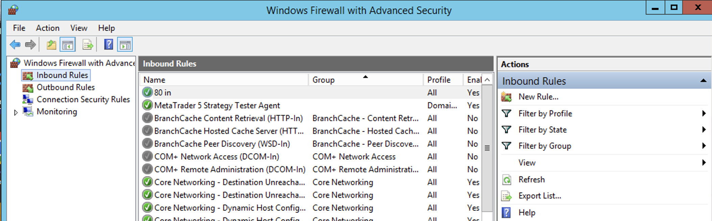

# MT5 Trade Dashboard

> A web-based trading dashboard for MetaTrader 5 with real-time position monitoring, risk management, and remote trade control.

[](https://www.python.org/)
[](https://www.metatrader5.com/)
[](LICENSE)

---

## Table of Contents

- [Overview](#overview)
- [Features](#features)
- [Screenshots](#screenshots)
- [Prerequisites](#prerequisites)
- [Installation](#installation)
- [SSL Configuration](#ssl-configuration)
- [Running the Application](#running-the-application)
- [MT5 Configuration](#mt5-configuration)
- [Project Structure](#project-structure)
- [Security Notes](#security-notes)
- [Troubleshooting](#troubleshooting)
- [Resources](#resources)
- [License](#license)

---

## Overview

**MT5 Trade Dashboard** is a Python-based web interface that connects to MetaTrader 5 via the `mt5` Python package. It provides:

- **Real-time monitoring** of open positions, account balance, and equity
- **Remote trade control** — modify stops, create orders, and manage positions from any browser
- **Risk management tools** — visualize risk exposure and set automated stops
- **Trailing stop automation** — configurable trailing stops with multiple strategies

> **Medium Article:** [Risk Management and Trailing Stop with MT5 (with code)](https://medium.com) — detailed walkthrough of the dashboard's core concepts.

---

## Features

| Feature | Description |
|---------|-------------|
| **Live Position Table** | View all open trades with P&L, margin, and symbol info |
| **Trade Modification** | Update stop-loss and take-profit levels remotely |
| **Order Creation** | Place market and pending orders through the web UI |
| **Account Summary** | Real-time balance, equity, margin level, and free margin |
| **Risk Visualization** | Color-coded risk exposure per symbol and position |
| **Trailing Stop Engine** | ATR-based, fixed-pip, and percentage-based trailing stops |
| **Multi-Symbol Watch** | Monitor multiple currency pairs from a single view |
| **SSL-Ready** | HTTPS support for secure remote access |

---

## Screenshots

### Dashboard Overview

*Main dashboard showing live positions, account stats, and symbol watchlist.*


*Alert based on price using: pushover*


*Orders (stop buy/sell) *


*Create stop buy/sell orders*

### MT5 Algorithmic Trading Settings

*Required MT5 configuration to allow Python-based trade operations.*

### Windows Firewall — Port 80 Rule

*Inbound rule for port 80 required during SSL certificate generation.*

---

## Prerequisites

Before you begin, ensure you have the following:

- [ ] **MetaTrader 5** installed and running on a Windows VPS or local machine
- [ ] **Python 3.8+** (recommended: [Anaconda](https://www.anaconda.com/download))
- [ ] **Windows Server** (for VPS deployment) or Windows 10/11
- [ ] A **domain name** or free subdomain (for SSL)
- [ ] Administrator access to configure Windows Firewall

---

## Installation

### 1. Install Anaconda

Download and install the latest Anaconda distribution:

```bash
# Visit: https://www.anaconda.com/download
# Or use the direct archive:
https://repo.anaconda.com/archive/
```

### 2. Clone the Repository

```bash
git clone https://github.com/OronSoft/mt5-trade-dashboard.git
cd mt5-trade-dashboard
```

### 3. Install Dependencies

```bash
pip install -r requirements.txt
```

**Key dependencies:**
- `MetaTrader5` — Python integration with MT5 terminal
- `Flask` / `FastAPI` — Web framework (check `server_mt5.py` for specifics)
- `pandas` — Data handling for position tables

---

## SSL Configuration

To enable HTTPS for secure remote access:

### Step 1: Register a Domain

Use a free DNS service to assign a URL to your VPS IP:

- **FreeDNS:** [https://freedns.afraid.org/subdomain/](https://freedns.afraid.org/subdomain/)

### Step 2: Install win-acme

Download and install the ACME client for Windows:

- **win-acme:** [https://www.win-acme.com/](https://www.win-acme.com/)

### Step 3: Open Port 80

Windows Firewall requires port 80 open for ACME domain validation:

1. Open **Windows Firewall with Advanced Security**
2. Navigate to **Inbound Rules** → **New Rule**
3. Select **Port** → **TCP** → **Specific local ports: `80`**
4. Allow the connection → Apply to all profiles
5. Name the rule: `80 in`


Verify the port is open:

```bash
python -m http.server 80
```

### Step 4: Generate Certificates

Run win-acme in manual mode and select **PEM files** as the output format.

### Step 5: Update Server Configuration

Edit `mt5_server.py` with your certificate filenames:

```python
cert_file = 'yourdomain.crabdance.com-crt.pem'
key_file  = 'yourdomain.crabdance.com-key.pem'
```

### Step 6: Open Dashboard Port

Add an inbound rule for port **8443** (or your chosen HTTPS port):

| Rule Name | Protocol | Port | Action |
|-----------|----------|------|--------|
| `Dashboard HTTPS` | TCP | 8443 | Allow |

---

## Running the Application

### Start the Server

Using the Anaconda console:

```bash
python server_mt5.py
```

### Access the Dashboard

Open your browser and navigate to:

```
https://yourdomain.crabdance.com:8443
```

### Default Credentials

| Field | Value |
|-------|-------|
| **Username** | `admin` |
| **Password** | `xxxxxx` *(change immediately after first login)* |

> **Security Tip:** Change the default password in the configuration file before deploying to production.

---

## MT5 Configuration

By default, MetaTrader 5 blocks algorithmic trading from external Python scripts. To enable trade operations:

1. Open MT5 → **Tools** → **Options** → **Expert Advisors**
2. Check the following boxes:
   - ✅ **Allow algorithmic trading**
   - ✅ **Allow DLL imports** *(required for `MetaTrader5` Python package)*
   - ✅ **Allow WebRequest for listed URL:** *(if your dashboard uses webhooks)*


> ⚠️ **Warning:** Enabling these options increases security risk. Only allow on trusted networks and VPS environments.

---

## Project Structure

```
mt5-trade-dashboard/
├── server_mt5.py          # Main Flask/FastAPI server
├── requirements.txt       # Python dependencies
├── README.md               # This file
├── LICENSE                 # MIT License
├── config/
│   └── settings.py         # Server & auth configuration
├── static/
│   ├── css/               # Dashboard styles
│   └── js/                # Frontend scripts
├── templates/
│   └── index.html          # Main dashboard UI
├── modules/
│   ├── mt5_connector.py    # MT5 terminal interface
│   ├── risk_manager.py     # Risk calculation engine
│   └── trailing_stop.py    # Trailing stop logic
└── docs/
    └── screenshots/        # Documentation images
```

---

## Security Notes

| Risk | Mitigation |
|------|------------|
| **Default password** | Change immediately in `config/settings.py` |
| **HTTP exposure** | Always use HTTPS in production (see SSL section) |
| **MT5 trading access** | Restrict VPS firewall to your IP only |
| **DLL imports** | Only enable on isolated trading VPS |
| **Certificate renewal** | Set up auto-renewal in win-acme |

---

## Troubleshooting

| Issue | Solution |
|-------|----------|
| `Connection refused` on port 8443 | Verify Windows Firewall inbound rule for 8443 |
| MT5 not responding to orders | Check "Allow algorithmic trading" in MT5 Options |
| SSL certificate error | Confirm PEM filenames match `mt5_server.py` config |
| Dashboard shows no positions | Ensure MT5 is logged in and has active trades |
| Module not found | Re-run `pip install -r requirements.txt` |

---

## Resources

- [MetaTrader 5 Python Documentation](https://www.mql5.com/en/docs/integration/python_metatrader5)
- [win-acme SSL Guide](https://www.win-acme.com/manual/getting-started)
- [FreeDNS Subdomain Setup](https://freedns.afraid.org/)
- [Medium Article: Risk Management & Trailing Stop](https://medium.com)

---

## License

This project is licensed under the **MIT License** — see the [LICENSE](LICENSE) file for details.

---

<p align="center">
  Built with Python + MetaTrader 5 for traders who want full control.
</p>
